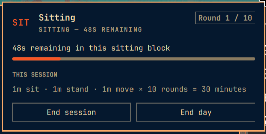

# Kinetics



An Omarchy top-bar plugin for cycling through sitting, standing, and moving.

Defaults are 20 minutes sitting, 8 minutes standing, 2 minutes moving, and
3 rounds per session (90 minutes total). Open the top-bar icon to start the
day, adjust settings, start or end sessions, end the day, and reset for the
next day.

The plugin stores the current day at
`~/.local/state/omarchy/kinetics/day.json` (or the equivalent under
`XDG_STATE_HOME`), so an active timer and totals survive shell reloads.

## Installation

### Via Omarchy CLI (Git)

```bash
omarchy plugin add https://github.com/RubarMo/omarchy-kinetics.git --enable
```

### Manual Installation

Clone or copy this repository into `~/.config/omarchy/plugins/rubar.kinetics/`:

```bash
omarchy-shell shell rescanPlugins
omarchy plugin enable rubar.kinetics
```

The widget's manifest requests the right side of the top bar by default.

## Removal

To disable and uninstall the plugin:

```bash
omarchy plugin disable rubar.kinetics
omarchy plugin remove rubar.kinetics
```

## Dependencies & License

- **Dependencies**: None (pure QML/JS utilizing built-in Omarchy shell APIs).
- **License**: [MIT](LICENSE)
